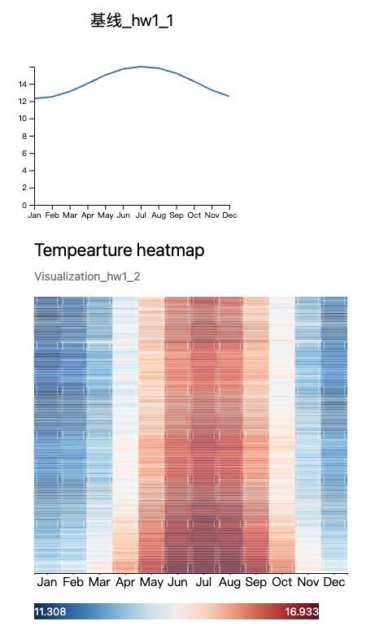

# Short Report
龚海琦 2021551005 hw1
## Visualization Output

## Description of the pattern
We can find that in each year, the temperature is **higher during the summer of the northern half of the earth**. We can also find that from 1849 to 2021, the **Global temperature has been increasing**, which is a proof that the Global Warming is** happening and becoming increasingly serious** since the Industrial Revolution.