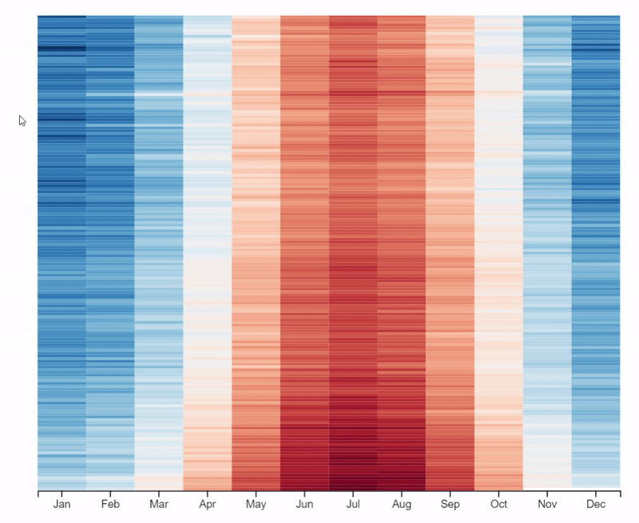

# ARTS 1422: Data Visualization, Spring 2023

## Homework 1

(Due on Tuesday, Feb.28 at 23:59)

Note that D3.js is the only library allowed to finish this assignment. In addition, please use D3 v4 or above.

### Problem 1

In this problem, we need to visualize the global monthly mean temperature data. The values were determined by measuring the air temperature above sea ice. Each entry of the main `temperature.csv` file covers the information of a single month in a single year. It contains the `year`, the `month`, the `anomaly` and the `uncertainty`. The `anomaly` column shows how much the estimated global temperature in °C of the corresponding month in the corresponding year deviated from a given reference value for that month. The reference value was determined by averaging the temperatures of the given month between Jan 1951 and Dec 1980. The reference values in °C are listed in the following `dataBaseline` table:

| Jan   | Feb   |  Mar  | Apr   | May   | Jun   | Jul   | Aug   | Sep   | Oct   | Nov   | Dec   |
| ----- | ----- | :---: | ----- | ----- | ----- | ----- | ----- | ----- | ----- | ----- | ----- |
| 12.29 | 12.50 | 13.11 | 14.03 | 15.01 | 15.72 | 15.99 | 15.82 | 15.23 | 14.30 | 13.28 | 12.55 |

The `uncertainty` column shows how accurately the given `anomaly` value could be estimated, which is not used in this problem.

*Note: The values during summer are relatively low because the global mean temperature covers both the northern and the southern hemisphere, where summer and winter are interchanged.*

#### Task 1 (3 points):

To present the above table in a more easily comparable way, create a **line chart** to depict the reference values for the different months. This information is contained in above `dataBaseline`  table. The line chart should contain x- and y-axis information.

#### Task 2 (5 points):

- Visualize the *monthly absolute values* contained with a **heatmap**. The rows should represent the years and the columns the months. To compute the *monthly absolute values*, use the `anomaly` values from `temperature.csv` file and the monthly reference values from above `dataBaseline` table  to derive the absolute temperature values for each entry in `temperature.csv`. 

- Use the colorscale such that the darkest shade of blue correspond to the lowest absolue temperature and the darkest shade of red to the highest absolute temperature. 
- Include an x-axis in the view containing the month information. Since the data covers a lot of years, we do not want to display all the year labels at the same time as a y-axis. Instead, when hovering over a rectangle of the heatmap, highlight it with a stroke and display the corresponding year next to the corresponding row.
- A legend is needed to show the mapping between colors and values.

*Hints: 
Note that in `temperature.csv`, the months are referred to as numbers from 1 to 12, and in `dataBaseline`, they are referred to as 'Jan', 'Feb', etc. 
For the colorscale, use `d3.interpolateRdBu`. It is a function that takes a value between 0 and 1 as an input to interpolate the returned color between red, white and blue. (To explore more colorscales, visit https://github.com/d3/d3-scale-chromatic.)
The resulting visualization should look something like this:*

#### Task 3 (2 points):

A shor report of your work: Take the screenshots of the visualization, describe the visualization and interesting patterns you find. It should be less than 150 words. 

### Submission:

- A `.html` file with your D3 JavaScript implementation of Task 1 and Task 2.
- A `.pdf` file of Task 3
- Put all above into a `姓名_2020533138.zip` file and submit .